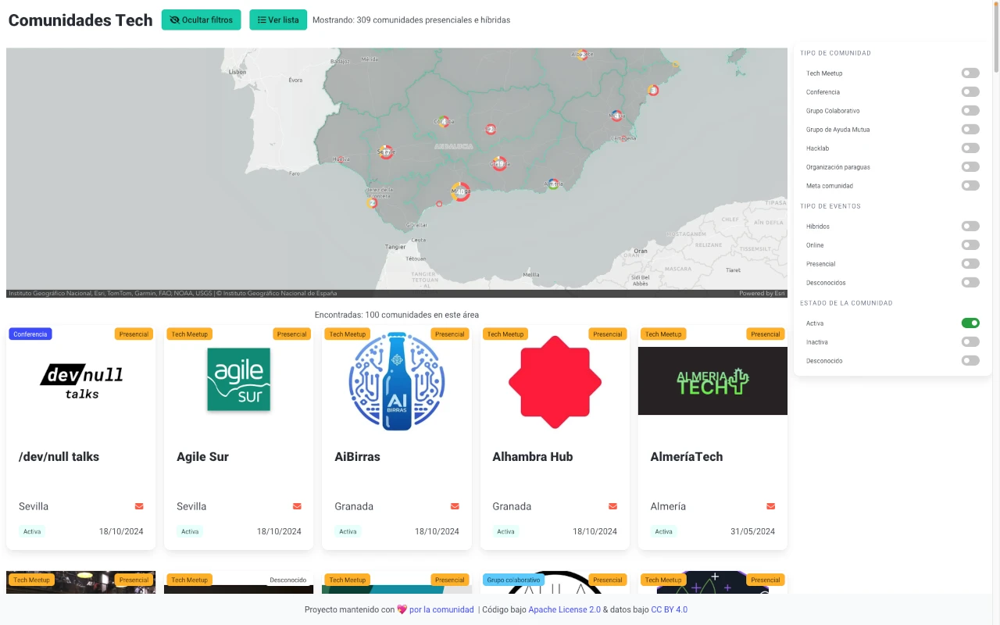

<!-- ALL-CONTRIBUTORS-BADGE:START - Do not remove or modify this section -->
[](#contributors)
<!-- ALL-CONTRIBUTORS-BADGE:END -->

# Communities directory

Este proyecto identifica y visibiliza comunidades tecnológicas en España (activas e inactivas) para que **cualquier persona interesada descubra fácilmente las opciones disponibles y encuentre las que se ajustan a sus intereses.**

También actúa como punto de encuentro para quienes desean dinamizar comunidades, facilitando el contacto con aquellas que buscan nuevas personas en sus equipos organizadores.

Además, muestra qué comunidades ya están representadas en **Community Builders**.

[](https://combuilderses.github.io/communities-directory/)


<!-- START doctoc generated TOC please keep comment here to allow auto update -->
<!-- DON'T EDIT THIS SECTION, INSTEAD RE-RUN doctoc TO UPDATE -->
## 📖 Índice

- [¿Por qué este proyecto?](#por-qué-este-proyecto)
- [Instalación y uso en local](#instalaci%C3%B3n-y-uso-en-local)
- [Roadmap](#roadmap)
- [Licencias](#licencias)
- [Contribuir](#contribuir)
- [Contributors](#contributors)

<!-- END doctoc generated TOC please keep comment here to allow auto update -->

## Por qué este proyecto

Este directorio puede ser útil en muchos escenarios:

**Si quieres crear o ayudar en una comunidad**:
- Te puede interesar unirte a una red con branding más fuerte o con un ecosistema más amplio.
- Puede ayudar a coordinar fechas y evitar solapes en grandes eventos del ecosistema.
- Puedes ver qué _organizaciones paraguas_ existen (como GDG, PyLadies, Cloud Native, ...) que ofrecen red de contactos, recursos, apoyo económico o simplemente *know-how*.
- Podrás encontrar comunidades con las que hacer sinergias o cocrear eventos.
- También te permite detectar comunidades que podrían reactivarse.

**Si estás buscando una comunidad en la que participar**:
- Es una forma rápida de descubrir comunidades (locales u online) que podrías haber pasado por alto.
- Útil si estás de viaje o te has mudado a otra ciudad y quieres encontrar comunidades allí.
- Pudiendo filtrar por ubicación y también por temática o tipo de actividad.

**Para quienes impulsamos comunidad**:
- Nos ayuda a tener una visión más global del ecosistema a nivel nacional.
- Nos permite conectar con comunidades actuales o antiguas, aprender de su experiencia.
- Podemos identificar personas interesadas en participar en encuentros presenciales de Community Builders.

> **Nota**: Puedes ver el hilo de correos donde explicamos el por qué del proyecto oficialmente por primera vez: [Listado de comunidades](https://groups.google.com/u/1/g/community-builders-es/c/agm4LEFrZco)

## Instalación y uso en local

Tan solo ejecuta:

```
git clone https://github.com/ComBuildersES/communities-directory.git
cd communities-directory
npm install
```

Y una vez hecho esto, puede arrancar el entorno de desarrollo con:

`npm run dev`

Esto iniciará la app en `http://localhost:5174/communities-directory/dist/`, donde podrás explorar el directorio interactivo.

## Contribuir
¿Te gustaría añadir una comunidad, mejorar datos existentes o proponer ideas?

Consulta la guía de colaboración → CONTRIBUTING.md

## Roadmap

Echa un vistazo a los *[milestones](https://github.com/ComBuildersES/communities-directory/milestones)* e *[issues](https://github.com/ComBuildersES/communities-directory/issues?q=sort%3Aupdated-desc+is%3Aissue+is%3Aopen)* del proyecto.

## Licencias

* El código fuente está disponible bajo la licencia [Apache 2.0](./LICENSE).
* Los datos en el directorio `public/data/` están bajo la licencia [CC BY 4.0](./LICENSE.data).

## Contribuir

¿Quieres unirte? -> [CONTRIBUTING.md](https://github.com/ComBuildersES/communities-directory/blob/master/CONTRIBUTING.md)

## Contributors

<!-- ALL-CONTRIBUTORS-LIST:START - Do not remove or modify this section -->
<!-- prettier-ignore-start -->
<!-- markdownlint-disable -->
<table>
  <tbody>
    <tr>
      <td align="center" valign="top" width="14.28%"><a href="https://manuelsaezcarmona.netlify.app/"><br /><sub><b>Manuel Saez Carmona</b></sub></a><br /><a href="https://github.com/ComBuildersES/communities-directory/commits?author=manuelsaezcarmona" title="Code">💻</a> <a href="#research-manuelsaezcarmona" title="Research">🔬</a> <a href="#maintenance-manuelsaezcarmona" title="Maintenance">🚧</a> <a href="#design-manuelsaezcarmona" title="Design">🎨</a></td>
      <td align="center" valign="top" width="14.28%"><a href="https://github.com/alvarogtrzcliment"><br /><sub><b>Álvaro Gutiérrez</b></sub></a><br /><a href="https://github.com/ComBuildersES/communities-directory/commits?author=alvarogtrzcliment" title="Code">💻</a> <a href="#research-alvarogtrzcliment" title="Research">🔬</a> <a href="#maintenance-alvarogtrzcliment" title="Maintenance">🚧</a> <a href="#design-alvarogtrzcliment" title="Design">🎨</a></td>
      <td align="center" valign="top" width="14.28%"><a href="https://github.com/Aleixbs"><br /><sub><b>Aleix Batlle</b></sub></a><br /><a href="https://github.com/ComBuildersES/communities-directory/commits?author=Aleixbs" title="Code">💻</a> <a href="#research-Aleixbs" title="Research">🔬</a> <a href="#maintenance-Aleixbs" title="Maintenance">🚧</a> <a href="#design-Aleixbs" title="Design">🎨</a></td>
      <td align="center" valign="top" width="14.28%"><a href="https://www.rauljimenez.info"><br /><sub><b>Raul Jimenez Ortega</b></sub></a><br /><a href="#data-hhkaos" title="Data">🔣</a> <a href="#maintenance-hhkaos" title="Maintenance">🚧</a> <a href="#projectManagement-hhkaos" title="Project Management">📆</a> <a href="#ideas-hhkaos" title="Ideas, Planning, & Feedback">🤔</a></td>
    </tr>
  </tbody>
</table>

<!-- markdownlint-restore -->
<!-- prettier-ignore-end -->

<!-- ALL-CONTRIBUTORS-LIST:END -->

Las instrucciones para añadirte o añadir emojis de contribución a tu nombre están [en este *issue*](https://github.com/ComBuildersES/communities-directory/issues/22). 
